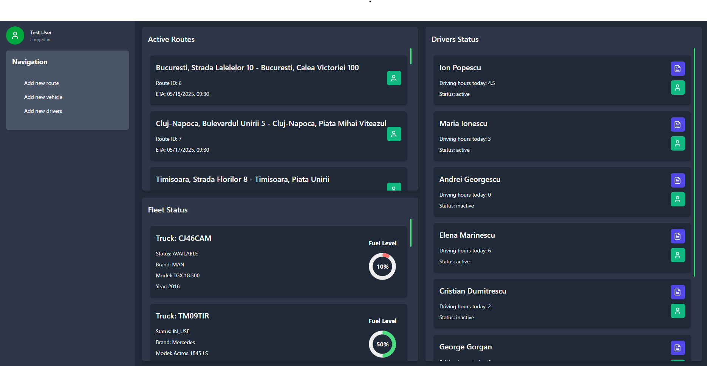
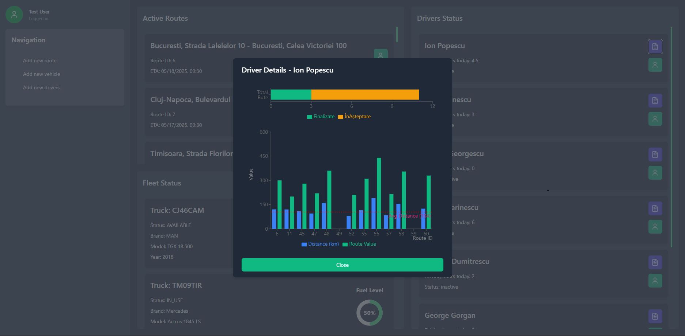
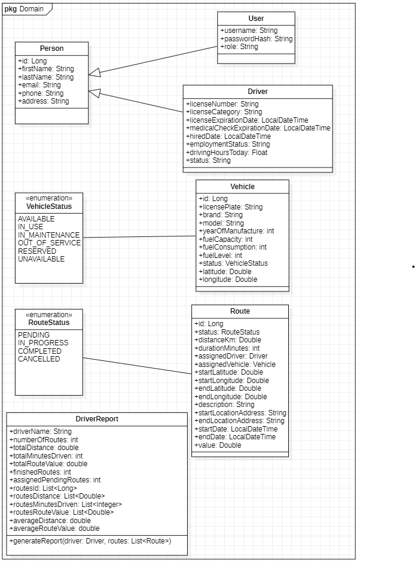
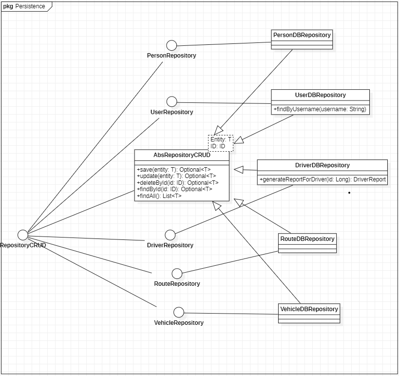
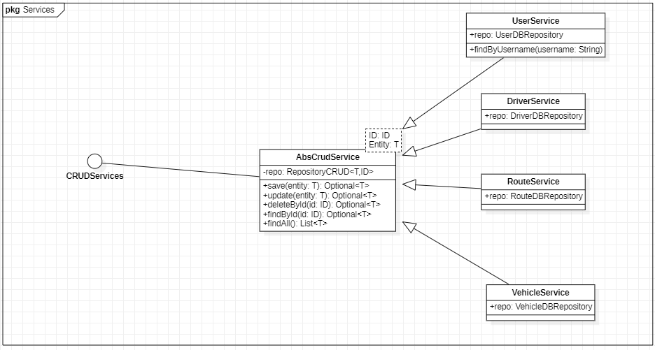
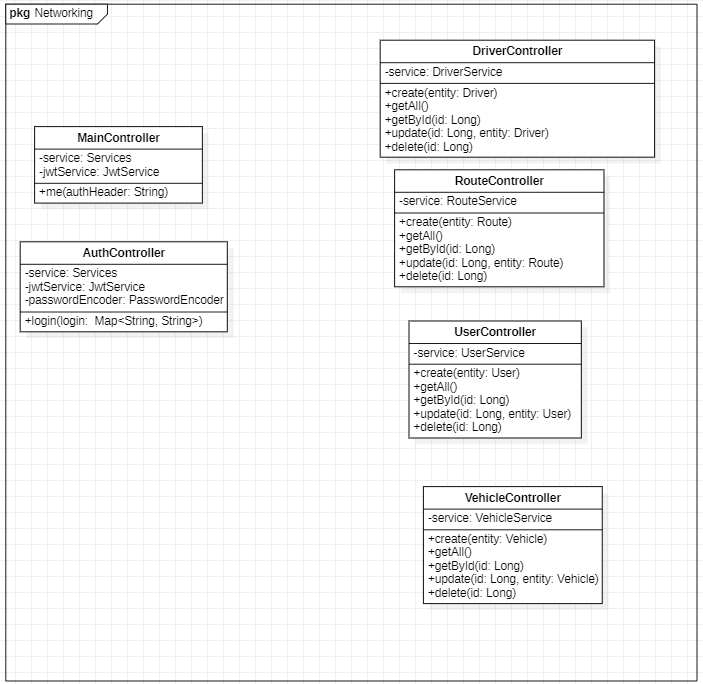

# 📦 AutoTrack

**AutoTrack** is a personal project developed locally for the purpose of learning and practicing modern technologies such as Spring Boot, React, Vite, and JWT. The application simulates a transport tracking system for routes, drivers, and vehicles, featuring authentication, logging, and a layered architecture.

> ⚠️ This project is not intended for production use. It was created solely for educational and learning purposes.

---

## 🧩 Key Features

### ✅ Backend (Spring Boot):
- Full REST API
- JWT-based authentication
- Logging using Log4j
- Hibernate ORM
- PostgreSQL database
- Layered architecture:
  - `domain` (entities)
  - `repository` (DAOs)
  - `services` (business logic)
  - `controllers` (REST API exposure)

### 🌐 Frontend (Vite + React + TypeScript):
- Login page (authentication with token storage)
- Dashboard:
  - Driver list (name, status, driving hours)
  - Vehicle list (status, fuel level, make, model)
  - Active routes (with ETA and locations)
- Add new:
  - Routes
  - Vehicles
  - Drivers
- Individual driver report view:
  - Completed routes
  - Pending routes
  - Kilometers traveled

---

## 📸 Screenshots

### 🔐 Login

### 🖥️ Dashboard

### 📊 Driver Statistics

---

## 📊 Diagrams Backend

### 🧱 Domain Layer

### 💾 Persistence Layer

### ⚙️ Service Layer

### 🌐 Networking & API Flow

---

## 🛠️ Tech Stack

| Layer         | Technology               |
|---------------|---------------------------|
| Frontend      | React + Vite + TypeScript |
| Backend       | Spring Boot               |
| Database      | PostgreSQL                |
| ORM           | Hibernate                 |
| Authentication| JWT Token                 |
| Logging       | Log4j                     |
| Architecture  | Layered MVC               |

---

